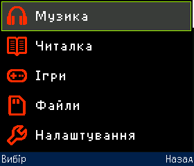
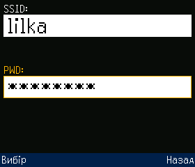
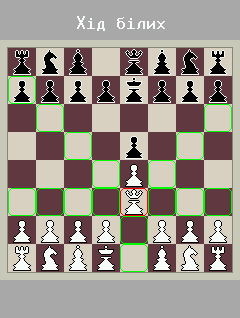
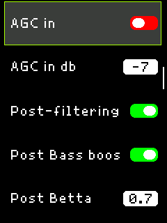
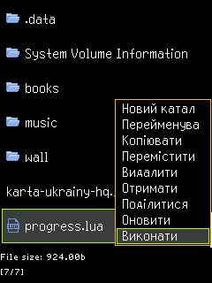
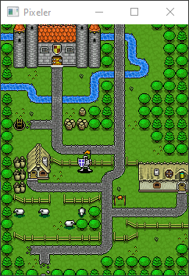

Pixeler - це фреймворк для розробки прошивки з мінімалістичним та швидким графічним інтерфейсом на мікроконтролери ESP32/S3/P4. Його написано мовою C++ з використанням Arduino та ESP-IDF. Основна ідея цього фреймворку полягає в тому, щоб уніфікувати та об’єднати більшість функцій, які необхідні майже в кожній прошивці на вищезазначені МК, в одну систему, при цьому не втрачаючи простоти і зручності Arduino. Для виводу графіки на дисплей, використовується власна бібліотека на основі Arduino_GFX. 

Важливо: Pixeler не є самодостатньою прошивкою. Це лише каркас, набір класів, що об’єднані певною архітектурою, та вирішують різноманітні задачі. Для його перетворення в повноцінну прошивку, необхідно на основі запропонованої архітектури додати власну керуючу логіку.

### Основні можливості

* Архітектура, що пропонує повне  автоматичне керування життєвим циклом поточного контексту програми, та яка дещо схожа на Activity в Android. 
* Обробка вводу з сенсорного екрану, сенсорних, тактових кнопок, клавіатури, а також з МК-розширювача GPIO по шині I2C за власним протоколом. Підтримується одночасна перевірка будь-якої кількості кнопок на відтискання, утримання та довге утримання.
* Набір віджетів, з яких можна легко збирати графічний інтерфейс користувача для кожного окремого контексту та його станів.
* Власний, повністю інтегрований в Pixeler, файловий менеджер для швидкої та ефективної взаємодії з картою пам'яті по шинах SPI та SDIO.
* Простий 2D ігровий рушій з підтримкою обміну даними між МК по WiFi.
* Вбудований інтерпретатор Lua, для якого реалізовано підтримку обробки вводу, створення та керування більшістю віджетів, доступ до GPIO, карти пам'яті, I2C, UART, WiFi з можливістю надсилання запитів в мережі.
* Портована на Linux та Windows графічна частина Pixeler, що дозволяє розробляти графічний інтерфейс безпосердньо на ПК, без необхідності щоразу завантажувати прошивку на мікроконтролер для тестування.
* Можливість збірки прошивки як з графічним інтерфейсом так і без нього.

### Сфера застосування

Pixeler може бути використаний, як основа, для будь-якого складного пристрою, в якому є ввід та/або вивід зображення на кольоровий дисплей. Це можуть бути ігрові консолі, програвачі аудіо, пульти/панелі керування електронними пристроями тощо.

